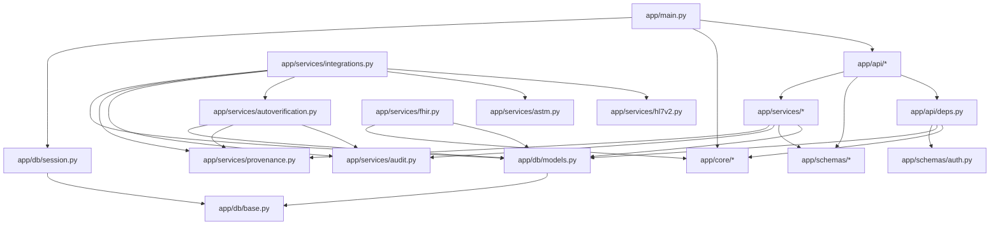

# Drzewo Zależności

Ten dokument pokazuje **aktualne zależności modułów w kodzie**, a nie tylko docelowy plan architektoniczny.

## Widok Wysokopoziomowy



## Drzewo Modułów

```text
app/main.py
├─ app/api/*
│  ├─ app/api/deps.py
│  │  ├─ app/core/config.py
│  │  ├─ app/core/security.py
│  │  ├─ app/db/models.py
│  │  └─ app/schemas/auth.py
│  ├─ app/api/health.py
│  │  ├─ app/core/config.py
│  │  └─ app/schemas/common.py
│  ├─ app/api/auth.py
│  │  ├─ app/api/deps.py
│  │  ├─ app/schemas/auth.py
│  │  └─ app/services/auth.py
│  ├─ app/api/patients.py
│  │  ├─ app/api/deps.py
│  │  ├─ app/schemas/patients.py
│  │  └─ app/services/patients.py
│  ├─ app/api/catalog.py
│  │  ├─ app/api/deps.py
│  │  ├─ app/schemas/catalog.py
│  │  └─ app/services/catalog.py
│  ├─ app/api/orders.py
│  │  ├─ app/api/deps.py
│  │  ├─ app/schemas/orders.py
│  │  └─ app/services/orders.py
│  ├─ app/api/specimens.py
│  │  ├─ app/api/deps.py
│  │  ├─ app/schemas/specimens.py
│  │  └─ app/services/specimens.py
│  ├─ app/api/tasks.py
│  │  ├─ app/api/deps.py
│  │  ├─ app/schemas/tasks.py
│  │  └─ app/services/tasks.py
│  ├─ app/api/observations.py
│  │  ├─ app/api/deps.py
│  │  ├─ app/schemas/observations.py
│  │  └─ app/services/observations.py
│  ├─ app/api/reports.py
│  │  ├─ app/api/deps.py
│  │  ├─ app/schemas/reports.py
│  │  └─ app/services/reports.py
│  ├─ app/api/devices.py
│  │  ├─ app/api/deps.py
│  │  ├─ app/schemas/devices.py
│  │  └─ app/services/devices.py
│  ├─ app/api/integrations.py
│  │  ├─ app/api/deps.py
│  │  ├─ app/schemas/integrations.py
│  │  └─ app/services/integrations.py
│  ├─ app/api/autoverification.py
│  │  ├─ app/api/deps.py
│  │  ├─ app/schemas/autoverification.py
│  │  └─ app/services/autoverification.py
│  ├─ app/api/audit.py
│  │  ├─ app/api/deps.py
│  │  ├─ app/schemas/audit.py
│  │  ├─ app/services/audit.py
│  │  └─ app/services/provenance.py
│  └─ app/api/fhir.py
│     ├─ app/api/deps.py
│     └─ app/services/fhir.py
├─ app/core/*
│  ├─ app/core/config.py
│  └─ app/core/security.py
├─ app/db/*
│  ├─ app/db/base.py
│  ├─ app/db/models.py -> app/db/base.py
│  └─ app/db/session.py -> app/db/base.py
├─ app/schemas/*
│  └─ warstwa kontraktów Pydantic bez logiki domenowej
└─ app/services/*
   ├─ auth.py
   │  ├─ app/core/config.py
   │  ├─ app/core/security.py
   │  ├─ app/db/models.py
   │  ├─ app/schemas/auth.py
   │  └─ app/services/audit.py
   ├─ patients.py / catalog.py / devices.py / orders.py / specimens.py / tasks.py
   │  ├─ app/db/models.py
   │  ├─ odpowiednie app/schemas/*
   │  └─ app/services/audit.py
   ├─ observations.py / reports.py
   │  ├─ app/db/models.py
   │  ├─ odpowiednie app/schemas/*
   │  ├─ app/services/audit.py
   │  └─ app/services/provenance.py
   ├─ autoverification.py
   │  ├─ app/db/models.py
   │  ├─ app/schemas/autoverification.py
   │  ├─ app/services/audit.py
   │  └─ app/services/provenance.py
   ├─ integrations.py
   │  ├─ app/db/models.py
   │  ├─ app/schemas/integrations.py
   │  ├─ app/services/hl7v2.py
   │  ├─ app/services/astm.py
   │  ├─ app/services/autoverification.py
   │  ├─ app/services/audit.py
   │  └─ app/services/provenance.py
   ├─ fhir.py
   │  ├─ app/core/config.py
   │  └─ app/db/models.py
   ├─ audit.py
   │  ├─ app/db/models.py
   │  └─ app/schemas/audit.py
   ├─ provenance.py
   │  ├─ app/db/models.py
   │  └─ app/schemas/audit.py
   ├─ hl7v2.py
   │  └─ moduł pomocniczy bez zależności na warstwę DB
   └─ astm.py
      └─ moduł pomocniczy bez zależności na warstwę DB
```

## Jak Czytać To Drzewo

- `main.py` składa aplikację i jest punktem wejścia.
- `api/` zależy głównie od `deps`, `schemas` i `services`.
- `schemas/` to warstwa kontraktów i typów wejścia/wyjścia.
- `services/` to centrum logiki biznesowej.
- `db/models.py` jest jednym z najważniejszych punktów wspólnych, bo większość serwisów operuje na tych modelach.
- `audit.py` i `provenance.py` są usługami przekrojowymi używanymi przez wiele modułów.
- `integrations.py` jest najgęstszym modułem zależności, bo spina HL7 v2, ASTM, device gateway, audit, provenance i autoweryfikację.

## Najważniejsze Węzły Krytyczne

- `app/api/deps.py`
  Centralny punkt zależności HTTP: auth, role i sesja DB.
- `app/db/models.py`
  Wspólny model runtime persistence dla większości logiki.
- `app/services/integrations.py`
  Główny punkt integracyjny systemu.
- `app/services/autoverification.py`
  Warstwa decyzji automatycznych nad observation.
- `app/services/fhir.py`
  Miejsce translacji modelu LIS do FHIR R4.

## Co To Mówi O Architekturze

Repo jest dziś modularnym monolitem o dość czystym podziale:

- HTTP i security na wejściu,
- contracts w `schemas/`,
- logika biznesowa w `services/`,
- persistence w `db/`.

Największe sprzężenie występuje naturalnie w integracjach i wokół modeli DB, ale ogólny kierunek zależności jest nadal zdrowy:

`api -> services -> db`

z warstwami przekrojowymi:

- `schemas`
- `audit`
- `provenance`
- `core`
