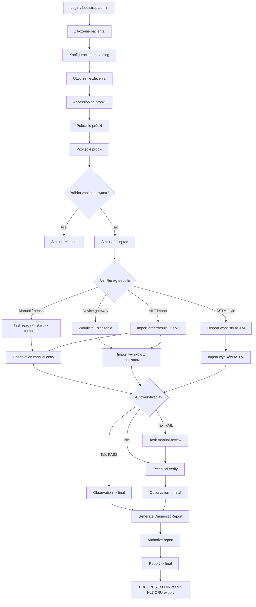
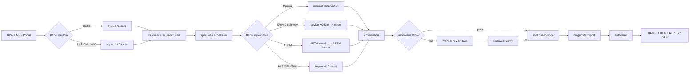
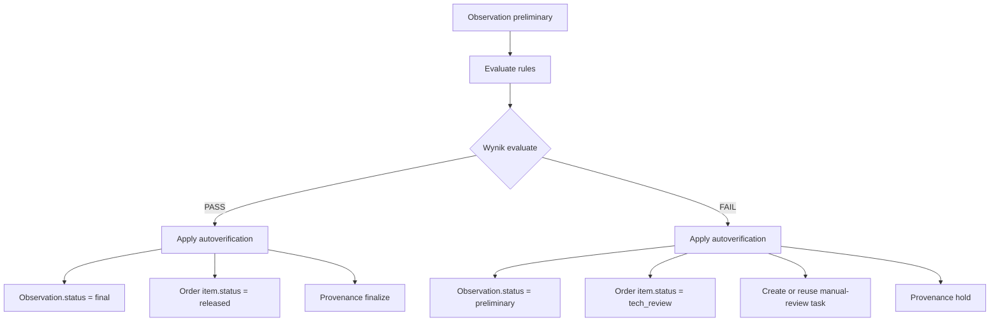

# Workflow LIS

Ten dokument pokazuje **rzeczywisty workflow obsługiwany dziś przez backend**, a nie tylko docelowy model architektoniczny.

## 1. Główny Workflow Operacyjny

## 2. Co Oznacza Każdy Etap

### Wejście do systemu

- `Login / bootstrap admin`
  System potrafi zainicjalizować pierwszego administratora, a potem pracować przez JWT auth i RBAC.
- `Założenie pacjenta`
  Tworzony jest rekord pacjenta z MRN i danymi podstawowymi.
- `Konfiguracja test-catalog`
  Tworzone są pozycje katalogu badań, które później trafiają do zleceń, mapowań urządzeń i wyników.

### Zlecenie i próbka

- `Utworzenie zlecenia`
  Powstaje `lis_order` wraz z co najmniej jedną pozycją `lis_order_item`.
- `Accessioning próbki`
  System nadaje `accession_no` i tworzy rekord próbki.
- `Pobranie próbki`
  Rejestrowany jest czas pobrania, opcjonalnie barkody kontenerów.
- `Przyjęcie próbki`
  Próbka może zostać przyjęta albo odrzucona.

### Wykonanie badania

- `Manual / bench`
  Operator pracuje na tasku laboratoryjnym i wprowadza wynik ręcznie.
- `Device gateway`
  System wystawia worklistę dla urządzenia i przyjmuje import wyników.
- `ASTM-style`
  System umie wygenerować prostą worklistę ASTM i zaimportować wynik ASTM.
- `HL7 import`
  System umie przyjąć `OML^O33` oraz `ORU^R01`.

### Wynik

- `Observation manual entry`
  Wynik może zostać wpisany ręcznie.
- `Import wyników z analizatora`
  Wynik może wejść z device gateway.
- `Import wyników ASTM`
  Wynik może wejść ze ścieżki ASTM-style.

### Walidacja

- `Autoweryfikacja`
  Jeżeli reguły przejdą, observation idzie od razu do `final`.
- `Task manual-review`
  Jeżeli reguły nie przejdą, tworzony lub używany jest task przeglądu ręcznego.
- `Technical verify`
  Wynik jest zatwierdzany technicznie przez operatora.

### Raport

- `Generate DiagnosticReport`
  Tworzony jest raport zbierający finalne wyniki.
- `Authorize report`
  Raport dostaje podpis/autoryzację.
- `PDF / REST / FHIR / HL7 ORU`
  Raport może być pobrany jako PDF placeholder, odczytany przez REST/FHIR albo wyeksportowany jako `ORU^R01`.

## 3. Workflow Integracyjny

## 4. Workflow Autoweryfikacji

## 5. Statusy W Workflow

### `lis_order.status`

- `draft`
- `registered`
- `accepted`
- `in_collection`
- `received`
- `in_process`
- `tech_review`
- `med_review`
- `released`
- `amended`
- `cancelled`

### `lis_order_item.status`

- `draft`
- `registered`
- `scheduled`
- `collected`
- `received`
- `in_process`
- `tech_review`
- `med_review`
- `released`
- `amended`
- `cancelled`
- `entered_in_error`

### `specimen.status`

- `expected`
- `collected`
- `received`
- `accepted`
- `aliquoted`
- `in_process`
- `stored`
- `rejected`
- `disposed`

### `task_work.status`

- `created`
- `ready`
- `in_progress`
- `on_hold`
- `completed`
- `failed`
- `cancelled`

### `observation.status`

- `registered`
- `preliminary`
- `final`
- `amended`
- `corrected`
- `cancelled`
- `entered_in_error`

### `diagnostic_report.status`

- `registered`
- `partial`
- `preliminary`
- `final`
- `amended`
- `corrected`
- `entered_in_error`

## 6. Zdarzenia, Które Dziś Są Rejestrowane

- utworzenie zlecenia
- utworzenie próbki
- collect / receive / accept / reject próbki
- utworzenie i przejścia taska
- import wyniku z urządzenia
- import komunikatu HL7
- import komunikatu ASTM
- ręczne wprowadzenie wyniku
- technical verify
- autoverification apply
- generate report
- authorize report
- export komunikatu i odczyt wybranych zasobów

## 7. Reguły, Które Obowiązują

- raporty są wersjonowane i nie powinny być nadpisywane w miejscu
- surowy payload urządzenia ma zostać zachowany
- audit ma pozostać append-only
- provenance ma śledzić pochodzenie observation i report
- manualne i automatyczne wyniki muszą pozostać rozróżnialne
- autoweryfikacja może albo sfinalizować wynik, albo skierować go do ręcznego przeglądu

## 8. Co Jest Już Realnie Obsługiwane

Aktualny backend obsługuje end-to-end:

- workflow manualny
- workflow z device gateway
- workflow z ASTM-style importem
- workflow z HL7 v2 import/export
- workflow autoweryfikacji
- workflow raportowania i autoryzacji
- read/search po FHIR jako warstwę odczytową nad stanem LIS

Najważniejsza granica jest taka, że to nadal starter LIS, a nie kompletne środowisko produkcyjne z pełnym QC engine, pełnym framingiem analizatorowym i zamkniętym E2E na PostgreSQL.
